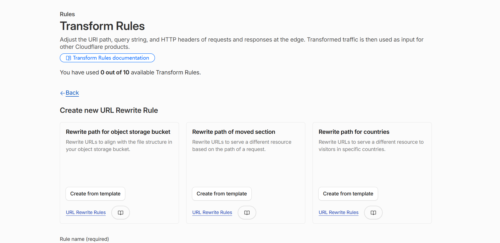
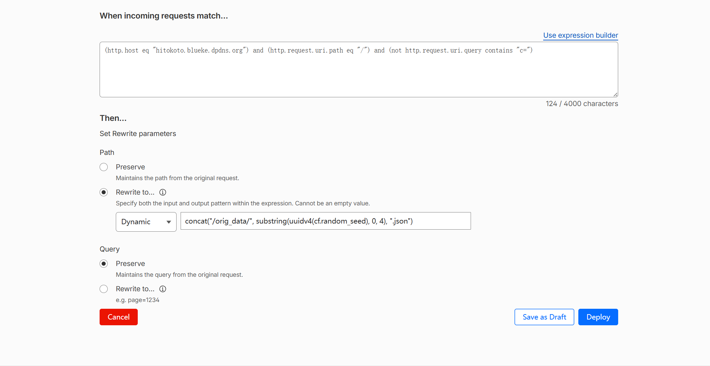

# Cloudflare Random Hitokoto

使用 GitHub Pages 托管静态一言数据，再通过 Cloudflare URL 重写规则把请求随机映射到 JSON 文件，实现无需 Worker、无服务端运行时的随机一言 API。

> 本项目 Fork 并修改自 [Mabbs/cf-hitokoto](https://github.com/Mabbs/cf-hitokoto)，数据来自 [hitokoto-osc/sentences-bundle](https://github.com/hitokoto-osc/sentences-bundle)。

## 工作原理

GitHub Actions 每 3 天拉取一次最新的一言数据，生成 `orig_data/` 和 `categories/` 静态文件，并直接部署到 GitHub Pages。Cloudflare 收到 API 请求后，使用随机 UUID 截取值重写请求路径：

- `/` → `/orig_data/xxxx.json`
- `/?c=a` → `/categories/a/xxx.json`

生成的数据只存在于 Pages 部署产物中，不提交到源码分支，因此日常拉取和维护代码不会再处理十几万个 JSON 文件。

## 部署方法

下面以以下信息为例，请替换为你自己的用户名和域名：

- GitHub 用户名：`yourname`
- API 域名：`hitokoto.example.com`
- GitHub Pages 目标：`yourname.github.io`

### 1. Fork 并启用 GitHub Actions

1. Fork 本仓库。
2. 进入 Fork 后的仓库，打开 **Actions**。
3. 如果 GitHub 提示工作流已被禁用，点击 **I understand my workflows, go ahead and enable them**。
4. 打开 **Update and Deploy** 工作流，点击 **Run workflow**，进行第一次构建。

工作流会自动拉取数据、生成静态文件、校验结果并部署 Pages，不会向仓库提交生成数据。

### 2. 启用 GitHub Pages

进入仓库的 **Settings → Pages**：

1. 在 **Build and deployment** 中将 **Source** 设为 **GitHub Actions**。
2. 在 **Custom domain** 中填写 API 域名，例如 `hitokoto.example.com`。
3. DNS 生效并签发证书后，启用 **Enforce HTTPS**。

### 3. 配置 Cloudflare DNS

在 Cloudflare 的 **DNS → Records** 中添加：

| 类型 | 名称 | 目标 | 代理状态 |
| --- | --- | --- | --- |
| CNAME | `hitokoto` | `yourname.github.io` | 先设为仅 DNS |

先使用“仅 DNS”（灰色云）让 GitHub 验证自定义域名。确认 GitHub Pages 可以通过自定义域名访问后，再切换为“已代理”（橙色云），否则 Cloudflare URL 重写规则不会生效。

在继续配置规则前，建议先确认下面两个静态地址能返回 JSON：

```text
https://hitokoto.example.com/orig_data/0000.json
https://hitokoto.example.com/categories/a/000.json
```

### 4. 打开正确的 Cloudflare 规则页面

进入对应域名的 Cloudflare 控制台，依次打开：

**Rules → Transform Rules → URL Rewrite Rules → Create rule**



> 必须使用 **URL Rewrite Rules（URL 重写规则）**，不要使用 **Redirect Rules（重定向规则）**。重定向规则会返回 301/302，而且其目标 URL 不允许使用 `cf.random_seed` 和 `uuidv4()`。

### 5. 创建“全库随机一言”规则

规则名称：

```text
全库随机一言
```

请求匹配方式选择 **Custom filter expression（自定义筛选表达式）**，填写：

```text
(http.host eq "hitokoto.example.com") and (http.request.uri.path eq "/") and (not http.request.uri.query contains "c=")
```

在重写参数中设置：

- **Path**：选择 **Rewrite to...**
- 类型：选择 **Dynamic**
- 路径表达式：

```text
concat("/orig_data/", substring(uuidv4(cf.random_seed), 0, 4), ".json")
```

- **Query**：选择 **Preserve**

配置效果如下：



确认无报错后点击 **Deploy**。

### 6. 创建“按分类随机一言”规则

再创建一条 URL 重写规则，规则名称填写：

```text
按分类随机一言
```

同样选择 **Custom filter expression（自定义筛选表达式）**，填写：

```text
(http.host eq "hitokoto.example.com") and (http.request.uri.path eq "/") and (http.request.uri.query contains "c=")
```

重写参数设置为：

- **Path**：**Rewrite to... → Dynamic**
- 路径表达式：

```text
concat("/categories/", substring(http.request.uri.query, 2, 3), "/", substring(uuidv4(cf.random_seed), 0, 3), ".json")
```

- **Query**：**Preserve**

确认无报错后点击 **Deploy**。

> 表达式中的 `4` 和 `3` 是当前数据量对应的十六进制文件名长度。数据规模跨过容量边界时可能自动变化，请以每次部署生成的 [`rules.txt`](rules.txt) 为准。

### 7. 验证部署

全库随机请求：

```text
https://hitokoto.example.com/
```

按分类随机请求：

```text
https://hitokoto.example.com/?c=a
```

连续刷新时应返回不同的一言对象。如果静态 JSON 地址能访问、但根路径不能访问，请重点检查：

1. DNS 记录是否已开启 Cloudflare 代理（橙色云）。
2. 创建的是 URL 重写规则，而不是重定向规则。
3. **Path** 是否为 **Rewrite to... → Dynamic**。
4. **Query** 是否为 **Preserve**。
5. 匹配条件和表达式中的域名是否已替换为你的真实域名。

## API 用法

请求地址：

```text
https://你的域名/
```

| 参数 | 值 | 是否必填 | 说明 | 示例 |
| --- | --- | --- | --- | --- |
| `c` | 见 [categories.json](categories.json) | 否 | 一言分类，单字符 | `?c=a` |

不带参数时返回全库随机一言。当前分类规则要求 `c` 是查询字符串中的第一个参数，推荐使用 `?c=a`，不要使用 `?foo=1&c=a`。

### 分类列表

| Key | 分类 | Key | 分类 |
| --- | --- | --- | --- |
| `a` | 动画 | `g` | 其他 |
| `b` | 漫画 | `h` | 影视 |
| `c` | 游戏 | `i` | 诗词 |
| `d` | 文学 | `j` | 网易云 |
| `e` | 原创 | `k` | 哲学 |
| `f` | 来自网络 | `l` | 抖机灵 |

完整信息请查看 [categories.json](categories.json)。

## 自动更新

GitHub Actions 默认每 3 天在 UTC 00:00 自动重新构建和部署，也可以在 Actions 页面手动运行 **Update and Deploy**。源码分支不保存生成数据，因此更新数据不会产生自动提交或干扰代码维护。
